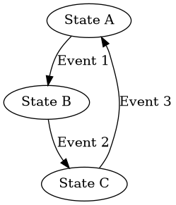

# Debug Player

## Overview

Debug Player is a framework for visualizing and analyzing recorded data through a plugin-based architecture. It allows you to load trips (recording sessions), visualize signals through various plot widgets, and navigate through the data with a timestamp slider.



### Key Features

- Plugin-based architecture for extensibility
- Temporal and spatial data visualization
- Interactive timestamp navigation
- Support for multiple signal types
- Dockable and customizable UI

## Installation

### System Requirements

- Python 3.12
- PySide6 (Qt for Python)
- Linux environment with appropriate Qt libraries

### Quick Start with Conda

The recommended way to install Debug Player is using the provided conda environment file:

```bash
# Create the conda environment from the environment.yml file
conda env create -f environment.yml

# Activate the environment
conda activate DbgPkg

# On Linux, you may need these system libraries
sudo apt update
sudo apt install libxcb-xinerama0 libxcb-cursor0 libxkbcommon-x11-0

# If QtCharts is missing, you may need to install these packages
sudo apt-get install libqt6charts6 libqt6charts6-dev
```

### Environment Variables

Some environment variables need to be set for proper operation, especially for Qt plugins:

```bash
# Set library path to prioritize conda environment libraries
export LD_LIBRARY_PATH=$CONDA_PREFIX/lib:$LD_LIBRARY_PATH

# Set Qt plugin path
export QT_PLUGIN_PATH=$CONDA_PREFIX/lib/Qt/plugins

# If you're having Wayland issues
export QT_QPA_PLATFORM=xcb
```

These environment variables are automatically set by the provided `run_debug_player.sh` script.

## Running Debug Player

The easiest way to run Debug Player is using the provided script:

```bash
# Make the script executable (first time only)
chmod +x run_debug_player.sh

# Run with a trip path
./run_debug_player.sh /path/to/your/trip/data/
```

Manually, you can run:

```bash
# Activate the conda environment
conda activate DbgPkg

# Set environment variables
export LD_LIBRARY_PATH=$CONDA_PREFIX/lib:$LD_LIBRARY_PATH
export QT_PLUGIN_PATH=$CONDA_PREFIX/lib/Qt/plugins

# Run with arguments
python main.py --trip1 /path/to/your/trip/data/
```

## Architecture

Debug Player is built around several key components:

### Core Components

- **PlotManager**: Coordinates data flow between plugins and plots
- **Data Loader**: Handles loading trip data and validation
- **Signal Validation**: Ensures signals are properly defined and typed

### Plugins

Plugins provide data from various sources and expose signals that can be visualized. The system includes these plugins:

- **CarPosePlugin**: Provides car position, orientation, and route data
- **PathViewPlugin**: Shows path data in world coordinates
- **CarStatePlugin**: Displays vehicle state data like speed and steering

### GUI Components

- **Main Window**: Overall UI container and coordination
- **Spatial Plot Widget**: Visualizes 2D spatial data
- **Temporal Plot Widget**: Shows time-series data
- **Timestamp Slider**: For navigating through time

## Plugin Development

Debug Player is designed to be extended with custom plugins. Follow these steps to create your own plugin:

### 1. Create Your Plugin Class

Create a new Python file in the `plugins` directory (e.g., `my_plugin.py`) and implement your plugin class that inherits from `PluginBase`:

```python
from interfaces.PluginBase import PluginBase

class MyPlugin(PluginBase):
    def __init__(self, file_path):
        super().__init__(file_path)
        
        # Set up your data sources
        self.data = self.load_my_data(file_path)
        
        # Define signals that your plugin provides
        self.signals = {
            "my_temporal_signal": {
                "func": self.get_my_temporal_data,
                "type": "temporal",
                "description": "My temporal data signal",
                "units": "meters"
            },
            "my_spatial_signal": {
                "func": self.get_my_spatial_data,
                "type": "spatial",
                "description": "My spatial data signal"
            }
        }
    
    def load_my_data(self, file_path):
        # Load your data from file_path
        return {}
    
    def get_my_temporal_data(self):
        # Return temporal data
        return {"timestamps": [1, 2, 3], "values": [10, 20, 30]}
    
    def get_my_spatial_data(self):
        # Return spatial data
        return {"x": [1, 2, 3], "y": [10, 20, 30]}
    
    def has_signal(self, signal):
        # Check if this plugin provides the requested signal
        return signal in self.signals
    
    def get_data_for_timestamp(self, signal, timestamp):
        # Return the data for the requested signal at the specified timestamp
        if not self.has_signal(signal):
            return None
        
        # Implement timestamp-specific data retrieval logic here
        # For example:
        if signal == "my_temporal_signal":
            return self.get_temporal_data_at_timestamp(timestamp)
        elif signal == "my_spatial_signal":
            return self.get_spatial_data()
        
        return None

# This line is REQUIRED for plugin discovery
plugin_class = MyPlugin
```

### 2. Signal Definition

Signals must have a type and a function that provides the data. Valid signal types are:

- **temporal**: Time-series data that changes with timestamp
- **spatial**: 2D or 3D spatial data (points, lines, polygons)
- **categorical**: Discrete category/state data
- **boolean**: Binary true/false data

Each signal definition must include:

- **func**: The function to call to retrieve data
- **type**: The signal type (from the list above)

Optional fields include:

- **description**: Human-readable description
- **units**: Units of measurement
- **valid_range**: Expected range of values
- **coordinate_system**: For spatial data

### 3. Data Format

Your data retrieval functions should return data in the expected format:

- **Temporal data**: Dictionary with keys like `value`, `values`, or type-specific fields
- **Spatial data**: Dictionary with `x` and `y` arrays (and optionally `z` for 3D)
- **Categorical data**: Dictionary with `category` or `state` field
- **Boolean data**: Dictionary with `value` as a boolean

## Troubleshooting

### Qt / PySide6 Issues

If you encounter Qt-related errors:

1. **Missing Libraries**:
   ```
   ImportError: libQt6Charts.so.6: cannot open shared object file: No such file or directory
   ```
   Solution: Install the missing Qt libraries:
   ```bash
   sudo apt-get install libqt6charts6 libqt6charts6-dev
   ```

2. **Plugin Path Issues**:
   ```
   qt.qpa.plugin: Could not find the Qt platform plugin "wayland" in ""
   ```
   Solution: Set the platform to xcb:
   ```bash
   export QT_QPA_PLATFORM=xcb
   ```

3. **Library Path Issues**:
   Solution: Use the environment variables:
   ```bash
   export LD_LIBRARY_PATH=$CONDA_PREFIX/lib:$LD_LIBRARY_PATH
   export QT_PLUGIN_PATH=$CONDA_PREFIX/lib/Qt/plugins
   ```

### Units and Conventions

Unless noted otherwise, Debug Player uses these conventions:

- Distance: meters
- Time: milliseconds
- Coordinate system: ENU (East-North-Up)
- Orientation: Right-Hand rule
- Vehicle forward direction: x-axis
- Car pose reference point: center of front axle

## Development Notes

For developers working on the Debug Player framework itself:

### Development Roadmap

The Debug Player development follows a structured roadmap with 4 phases:

1. **Foundation Strengthening (Current Phase)**
   - ✅ Fix dependency management and environment setup
   - ✅ Complete plugin interface definition
   - ✅ Add robust error handling and validation
   - ✅ Implement comprehensive testing framework
   - ✅ Enhance documentation

2. **Core Features Enhancement**
   - Refactor signal management system
   - Develop customizable view system
   - Enhance UI controls and interaction
   - Add data export capabilities
   - Implement timeline markers and annotations

3. **LLM Integration**
   - Add natural language query interface
   - Implement intelligent visualization recommendations
   - Create context-aware help system
   - Integrate insights generation

4. **Advanced Features**
   - Develop multi-view coordination system
   - Add collaboration tools
   - Optimize performance for large datasets
   - Create configuration management system

### Development Priorities

- Regular testing throughout development
- Atomic commits at major milestones
- Maintaining >80% test coverage
- Thorough documentation of APIs and interfaces

### Error Handling and Validation

Debug Player implements a comprehensive error handling system:

1. **Data Validation**
   - Trip path validation in `data_loader.py`
   - Custom `DataLoadError` exception for clear error messages
   - Early validation of input data with helpful error messages

2. **Signal Validation**
   - Dedicated `signal_validation.py` module to validate signal definitions
   - Type checking and format validation for all signals
   - Standardized signal format enforcement

3. **Plugin System**
   - Robust plugin loading with detailed error reporting
   - Plugin interface validation to ensure compatibility
   - Signal availability checking before data requests

### Testing

Run the test suite to verify your changes:

```bash
conda activate DbgPkg
python -m pytest tests/
```

Individual tests can be run as:

```bash
python -m pytest tests/test_plot_manager.py -v
```

### Component Interaction

1. **PlotManager Coordination**:
   - Plugins provide signals via `signals` dictionary
   - PlotManager queries plugins for signal data as needed
   - Widgets subscribe to signals and receive updates

2. **Signal Flow**:
   - User moves timestamp slider
   - PlotManager requests data for new timestamp
   - Plugins provide timestamp-specific data
   - Plot widgets visualize the data
   - Validated data is passed to appropriate plot widgets

## Contributing

Contributions to Debug Player are welcome! Please follow these steps:

1. Fork the repository
2. Create a feature branch
3. Add tests for your changes
4. Ensure all tests pass
5. Submit a pull request

## License

This project is proprietary and confidential.

---

For additional help or to report issues, please contact the development team.

*Documentation last updated: May 2024*